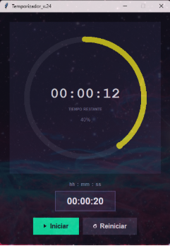
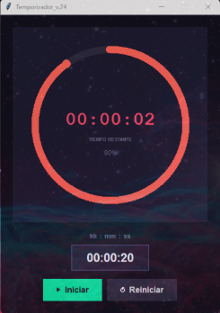
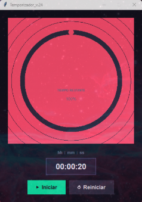
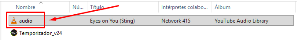
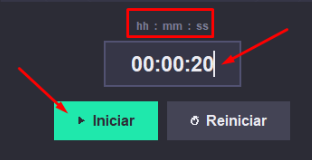

## Temporizador\_v.24

Con alarma. Y si lo minimizas, al finalizar el tiempo, se maximiza. Imposible no verlo.

Puedes cambiar el “audio.mp3” por otro sonido que quieras, solo renombre el mp3.

           

🖥️ Programa ejecutable (.exe) listo para usar

🆓 Totalmente gratuito

Puedes descargar la versión más reciente desde aquí:

## 👉 Descargar última versión
 📦 Descargar

## **🛠️ Cómo usar**

Descarga el archivo .zip desde la sección de Releases

Descomprime el archivo “Temporizador\_v24”

Ejecuta el archivo “Temporizador\_v24.exe”

Ingresa la cuenta regresiva:

## 📢 Canal de YouTube

Si te interesa el desarrollo de software, aplicaciones gratis y automatización:

👉 Suscríbete a mi canal:

<http://www.youtube.com/@CopyAndPasteFree>

📄 Licencia

Este proyecto es de uso libre para fines personales.

✍️ Autor

Carlos Villada

⭐ Apoya el proyecto

Si este proyecto te fue útil:

Dale ⭐ al repositorio

Compártelo

Suscríbete al canal

